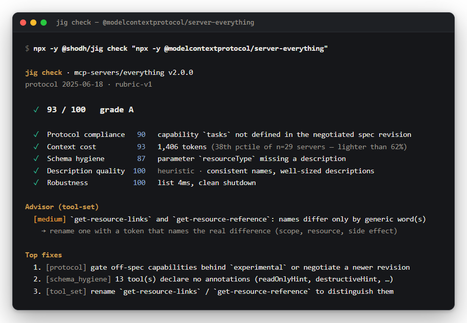
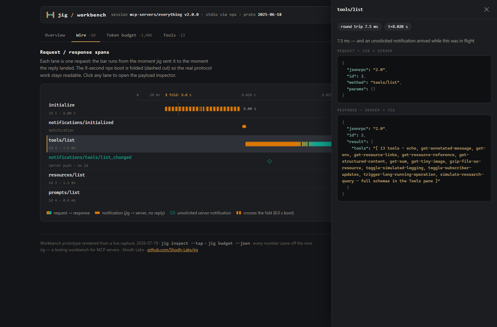
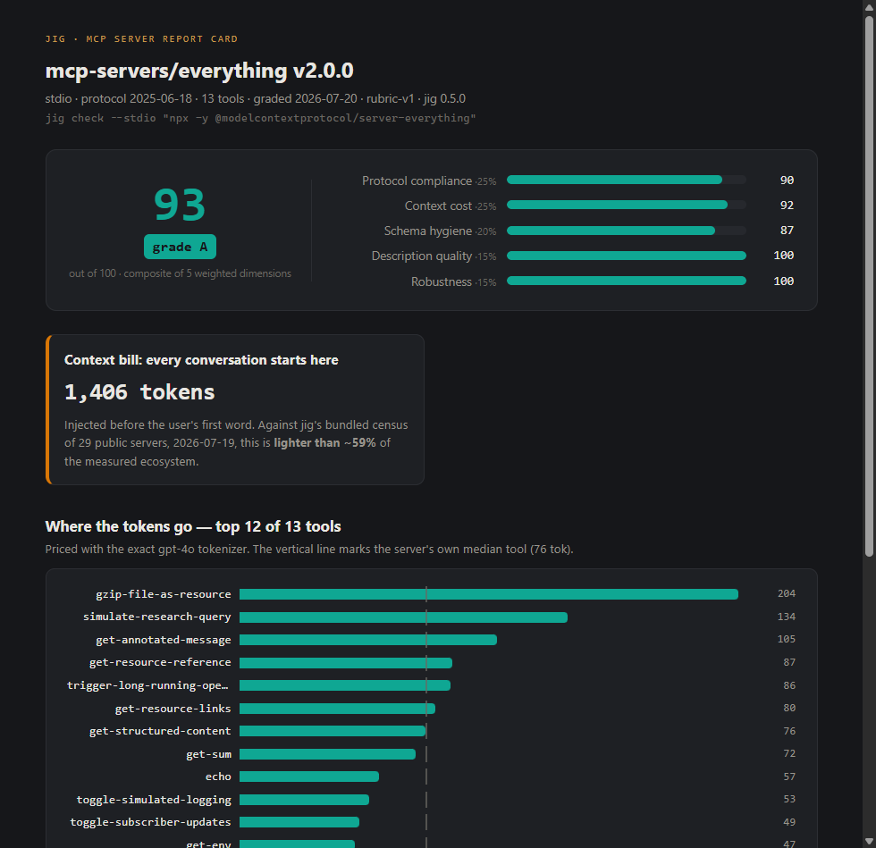
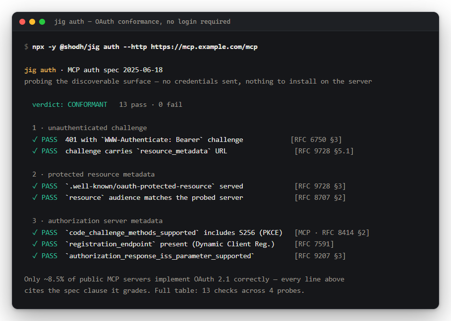
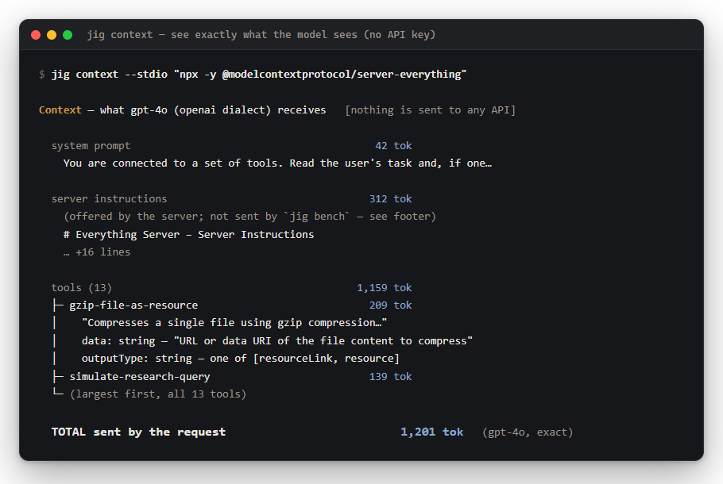
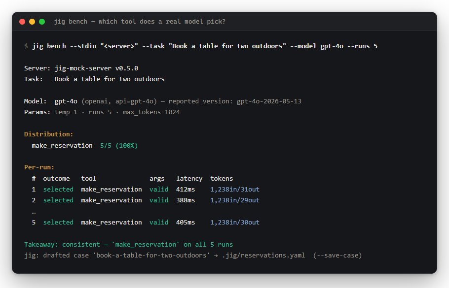
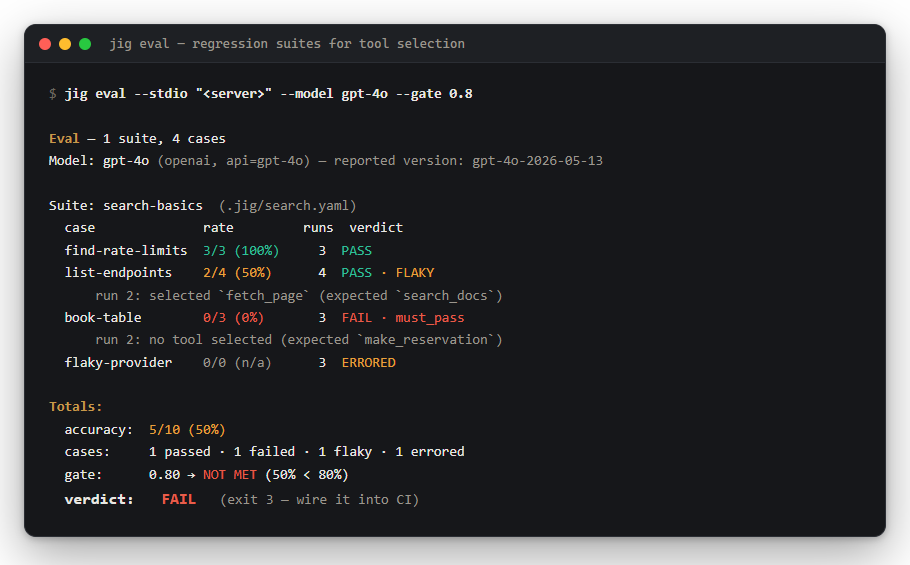

# Jig — grade your MCP server in one command

[](https://www.npmjs.com/package/@shodh/jig)
[](https://github.com/Shodh-Labs/jig/actions/workflows/ci.yml)
[](LICENSE)

```sh
npx -y @shodh/jig check "npx -y your-mcp-server"
```



*(Real output — Anthropic's own reference server, graded cold over `npx`.)*

**Jig is a testing workbench for MCP servers.** Models pick the wrong tools, token
bills balloon, and servers break their own protocol — and none of it is visible from
your server's code. Jig makes it visible, measurable, and regression-safe: no
account, no telemetry, a single checksummed binary, keys only when *you* put a
real model in the loop.

## What's in the box

| Command | The question it answers |
|:--|:--|
| [`jig check`](#jig-check--the-one-command-report-card) | Is my server well-built? One graded verdict + a shareable HTML report card |
| [`jig context`](#jig-context--see-exactly-what-the-model-sees) | What does the model actually see? The exact request body, token-priced — no API key needed |
| [`jig budget`](#jig-budget--the-token-budget-engine) | What does my server cost, per tool, per model tokenizer? |
| [`jig bench`](#jig-bench--the-model-in-the-loop-bench) | Which tool does a *real model* pick for a task? N-run distributions |
| [`jig eval`](#jig-eval--the-jig-eval-suite) | Did my change regress tool selection? Git-versioned suites, CI gates |
| [`jig inspect` / `call` / `read` / `prompt`](#transports-stdio-and-streamable-http) | Poke the protocol directly — every byte captured in a raw JSONL tap |
| [`jig servers` / `search` / `info`](#discovery-jig-servers-jig-search-jig-info) | What's configured on my machine? What exists? What is it *really*? |



<p align="center"><em>A real session against <code>@modelcontextprotocol/server-everything</code>, rendered from jig's protocol tap:
the 8-second npx cold start folded out of the way, an unsolicited mid-request notification caught on the wire,
payload inspector open. This is an interactive design prototype — the workbench app is not built yet; the CLI ships today.</em></p>

## Why a grade?

MCP servers can't be tested like APIs — a server "works" only if a **model**
understands its tool descriptions, selects the right tool, and fills the arguments
correctly. That surface is probabilistic, and the ecosystem's numbers show it:
independent 2026 measurements find 5–10 installed servers burning **50k+ tokens
before the first prompt**, selection accuracy collapsing past ~30 tools, and roughly
**half of public servers failing at startup** ([our own 50-server census](docs/census/2026-07-19-state-of-mcp-servers.md) measured 42%).
Today almost everyone tests by poking a chat client and eyeballing it. A grade with
ranked fixes replaces the eyeball.

**Want the standards behind the grade?** The
[MCP Server Design & Deployment SOPs](docs/sop/mcp-server-design-and-deployment.md)
— 33 numbered, evidence-cited rules, each with the exact jig command that verifies
it (and an honest label where none can yet).

> *A jig holds the workpiece and guides the tool, so every cut is repeatable.
> Your MCP server is the workpiece. The model is the tool.*

## Status

🚧 **Early development, building in public.** Open an issue and tell us how you test
your MCP server today — we read everything. Roadmap: `.jig` eval suites in CI with
PR annotations; refresh-token rotation and the device-authorization grant for
`jig auth --login` (the authorization-code + PKCE flow ships today); the desktop
workbench (in design — prototype exists, CLI ships today).

## Development

Jig is a Rust workspace (`cargo` 1.80+). Milestone 1 ships the core engine and the `jig` CLI.

```
crates/
  jig-core         # library: stdio + Streamable HTTP transports, MCP handshake + ops, protocol tap
  jig-cli          # binary `jig`: check / inspect / call / read / prompt / context / budget / bench / eval / servers / search / info
  jig-mock-server  # binary: a minimal MCP server (stdio + HTTP) used as a test fixture
```

Build and test the whole workspace:

```sh
cargo build
cargo test          # unit + integration tests (spawns the mock server)
cargo fmt --all
cargo clippy --all-targets
```

Try the CLI against the bundled mock server:

```sh
cargo build
# the one-command report card: score everything in one session
./target/debug/jig check --stdio "./target/debug/jig-mock-server"
# inspect what a server exposes (add --json for full machine output)
./target/debug/jig inspect --stdio "./target/debug/jig-mock-server" --tap traffic.jsonl
# invoke a single tool
./target/debug/jig call --stdio "./target/debug/jig-mock-server" \
    --tool echo --args '{"text":"hello"}'
# read a resource by URI (text prints verbatim; a blob prints its mimeType + base64 length)
./target/debug/jig read --stdio "./target/debug/jig-mock-server --resources-prompts" \
    --uri "mock://text/hello"
# fetch a prompt by name, filling its arguments
./target/debug/jig prompt --stdio "./target/debug/jig-mock-server --resources-prompts" \
    --name greet --args '{"name":"Ada"}'
# see exactly what the model sees — the token-annotated request body, no key needed
./target/debug/jig context --stdio "./target/debug/jig-mock-server"
# what does this server cost in context tokens, per tool, per model?
./target/debug/jig budget --stdio "./target/debug/jig-mock-server"
# which tool does a real model pick for a task? (needs ANTHROPIC_API_KEY / OPENAI_API_KEY)
./target/debug/jig bench --stdio "./target/debug/jig-mock-server" \
    --task "Book a table for two tonight" --model gpt-4o --runs 5
```

### `jig check` — the one-command report card

`jig check` is the front door: one command connects once and runs everything Jig
knows, then renders a **scored verdict with a to-do list** — Lighthouse for MCP
servers. Instruments require interpretation; a grade plus ranked fixes converts.

```sh
jig check --stdio "npx -y @playwright/mcp@latest"     # human report card + ./jig-report-<server>.html
jig check --stdio "<cmd>" --json                       # full findings + per-dimension scores
jig check --stdio "<cmd>" --badge                      # shields.io endpoint JSON for a README badge
jig check --stdio "<cmd>" --min-score 80               # CI gate: exit nonzero below the floor
jig check --stdio "<cmd>" --report card.html           # write the HTML report to a chosen path
jig check --stdio "<cmd>" --no-report                  # skip the HTML report
jig check --server "playwright"                        # a server discovered by `jig servers`, by name
jig check --http "https://example.com/mcp" --header "Authorization: Bearer $TOKEN"
```

Every run also writes this — the self-contained HTML report card, by default:



One session, one grade over five weighted dimensions (`rubric-v1.1`):

| Dimension | Weight | What it scores | How it's scored |
|:----------|-------:|:---------------|:----------------|
| Protocol compliance | 25 | handshake, stdout framing/pollution, spec-valid capabilities, timeouts | absolute penalties from 100 |
| Context cost | 25 | gpt-4o exact total tokens (percentile vs the ecosystem, or absolute bands) | interpolated bands; **caps the composite** when catastrophic |
| Schema hygiene | 20 | per tool: descriptions, param types & descriptions, annotations | **rate-based**, floor 15 |
| Description quality | 15 | *heuristic* — description length, name consistency, titles (no LLM) | **rate-based**, floor 15 |
| Robustness | 15 | *observed only* — list latency, clean shutdown | mean of observed sub-scores |

Grades: **A** ≥ 90 · **B** 80–89 · **C** 70–79 · **D** 60–69 · **F** < 60.

**Rate-based dimensions.** Schema hygiene and description quality grade
*per-item* defects, so they score the **rate** of defects rather than the raw
count — otherwise a large tool surface saturates the deduction on its own and
the dimension measures server size instead of server quality. For each defect
class *c* with per-item weight `p_c` (the class's relative severity):

```text
rate_c    = defective items in class c / total items in class c
deduction = SCALE * Σ_c ( p_c * rate_c )
score     = clamp(100 - deduction, 15, 100)
```

Tool-level classes divide by the tool count, parameter-level classes by the total
parameter count. `SCALE` is set per dimension so a 100%-defective server lands
exactly on the floor. The floor is **15, not 0**: a server that handshook and
listed its tools has produced *some* structure, and 0 stays reserved for
genuinely absent structure. A 90-tool server and a 5-tool server with the same
*proportion* of defects now score the same.

**The context-cost cap.** Context cost is a cost, not a quality — schema polish
cannot redeem a server that spends 42k tokens of every conversation. When the
context sub-score is catastrophic it bounds the composite outright: below 20
(beyond ~p95 of the census) caps at **65 (D)**, below 10 caps at **55 (F)**. The
cap is never silent — it emits a finding and a visible line naming the token
count and its multiple of the census median:

```
composite capped at 55 by context cost: 42,288 tokens is 25× the census median
```

> Scores from different rubric versions are **not comparable**. See
> [`docs/rubric-changelog.md`](docs/rubric-changelog.md) for what changed in
> `rubric-v1.1` and why.

Every deduction is a typed finding carrying the fix, and the three highest-impact
fixes are surfaced up top:

```
jig check · jig-mock-server v0.1.0
protocol 2025-06-18 · rubric-v1.1

  ✓  98 / 100   grade A

  ✓  Protocol compliance  100   clean handshake, no stdout pollution, spec-valid capabilities
  ✓  Context cost          99   183 tokens (no ecosystem data — absolute bands)
  ✓  Schema hygiene        94   `make_reservation`: parameter `party` missing a description (+1 more)
  ✓  Description quality   97   heuristic · 3 tool(s) have no human-facing title
  ✓  Robustness           100   list 3ms, clean shutdown

Top fixes
  1. [schema_hygiene] `make_reservation`: parameter `party` missing a description
     → describe each parameter of `make_reservation` so the model can fill it correctly
  2. [schema_hygiene] 3 tool(s) declare no annotations (readOnlyHint, destructiveHint, …)
     → add tool annotations so clients can reason about side effects
  3. [description_quality] 3 tool(s) have no human-facing title
     → add a `title` to each tool for nicer client display

Description quality is heuristic (deterministic, no LLM).
Context cost scored with absolute bands (no ecosystem dataset available).
```

**A shareable report card.** Human runs also write a self-contained HTML report —
`./jig-report-<server>.html` by default — a single file with inline styles and
**no JavaScript**: the score hero, the five dimension bars, a context-bill
callout, a per-tool token chart with a median marker, the advisor findings, and
the ranked fixes, all rendered from the same session's data. It is light/dark
theme-aware and every server-supplied string is HTML-escaped, so it is safe to
open and safe to share. `--report <file>` sets the path (and enables it in
`--json`/`--badge` mode); `--no-report` skips it.

**Honest scoring.** Context cost is graded against an ecosystem percentile
dataset — the census bundled into the binary by default, so even an `npx`/installed
run scores against the ecosystem (the report then says e.g. `bundled census
2026-07-19 (n=29) — 7th percentile`, always naming the sample size and its age).
Pass `--percentiles <file>` to use your own dataset, or `--percentiles none` to
fall back to the documented absolute bands. Description quality is deterministic
heuristics — labelled "heuristic", never an LLM verdict — and robustness scores
only what was actually observed in the session, never assumed. `--min-score <n>`
is the CI gate: wire `jig check --stdio "<cmd>" --min-score 80` into a pipeline
and a regression that drops the grade fails the build. See
[`docs/percentiles-schema.md`](docs/percentiles-schema.md) for the dataset
format.

#### Tool-set advisor

The rubric grades one tool at a time. But the failures that most reliably make a
model pick the *wrong* tool are emergent — they live in the relationship
*between* tools. `jig check` runs three deterministic detectors (no LLM) and, when
any fire, prints an `Advisor (tool-set)` block between the dimension lines and Top
fixes. The findings are tagged `tool_set` and are **not** scored into the
composite (whether to weight tool-set health is a separate decision), though they
can appear in Top fixes.

- **Naming collisions & ambiguity.** Tool names are tokenized (kebab/snake/camel
  all normalized) and compared. Names that reduce to the same action modulo known
  synonyms are flagged `high`; names that differ only by a generic word, or tools
  whose descriptions overlap ≥ 80% (Jaccard, stopwords removed), are `medium`:

  ```
  [high] `get_status` vs `fetch_status`: models cannot reliably distinguish these — same action, interchangeable words
    → merge them into one tool, or rename one with a token that names the real difference
  ```

- **Accuracy cliff.** Selection accuracy degrades materially once a server exposes
  more than a few dozen tools — a property of the count, not any one tool. `> 30`
  tools is `medium`, `> 50` is `high`:

  ```
  [medium] 31 tools exposed — past ~30 a model's tool-selection accuracy degrades materially
    → split into focused servers or defer rarely-used tools (server-side tool search is the structural fix)
  ```

- **Cost dominance.** Reusing the token budget already computed, a tool costing
  more than 3× the server's median (and over 200 tokens), or a top-3 that carries
  the majority of the surface's tokens, is called out:

  ```
  [medium] `take_screenshot` costs 231 tok — 8.2x your median tool; it dominates the surface's context bill
    → trim its description or flatten its input schema
  ```

The same block is available after the token table with
[`jig budget --advise`](#jig-budget--the-token-budget-engine).
### `jig auth` — grade the OAuth surface, or actually log in

Authorization is MCP's number-one integration pain: across the public ecosystem
only ~8.5% of servers implement the OAuth 2.1 flow the spec calls for, and the
failures are almost always in the *discoverable* surface — a missing
`WWW-Authenticate` challenge, metadata that points nowhere, an authorization
server that never advertises PKCE. `jig auth` grades exactly that surface.



By default it performs no authorization flow, opens no browser, and needs no
credentials: it sends one unauthenticated `initialize`, follows the `401`
challenge to the RFC 9728 / RFC 8414 metadata, and renders a conformance table
with a spec citation on every line. Everything checkable, nothing probabilistic —
the house style. Add `--login` and it runs the flow for real; see
[`--login`](#jig-auth---login--the-real-authorization-code-flow) below.

```sh
jig auth --http "https://mcp.example.com/mcp"                 # the conformance table
jig auth --http "https://mcp.example.com/mcp" --json          # every finding + every raw HTTP exchange (redacted)
jig auth --http "https://mcp.example.com/mcp" \
    --header "Authorization: Bearer $TOKEN"                   # also test that a real token is accepted
```

The four probes, each producing typed `PASS` / `FAIL` / `NOT-ADVERTISED` /
`UNREACHABLE` findings:

| Probe | What it grades | Spec |
|:------|:---------------|:-----|
| Unauthenticated challenge | 401? `WWW-Authenticate: Bearer`? carries `resource_metadata`? (a `200` is reported as "no auth") | RFC 6750, RFC 9728 §5.1 |
| Protected Resource Metadata | `resource`, `authorization_servers`, and an audience-match check (`resource` == the probed server) | RFC 9728, RFC 8707 |
| Authorization Server Metadata | PKCE `S256` (MCP **requires** it), DCR `registration_endpoint`, the auth/token endpoints, the RFC 9207 `iss` parameter | RFC 8414, RFC 7591, RFC 9207 |
| Header passthrough | *(only when you pass a token)* does `initialize` now succeed where the bare probe got 401? | RFC 6750 §2.1 |

```
jig auth · https://mcp.example.com/mcp
resource https://mcp.example.com/mcp · MCP auth spec 2025-06-18

  verdict: PARTIALLY CONFORMANT — some auth surfaces are missing or non-conformant
  12 pass · 1 fail · 0 not-advertised · 0 unreachable

Authorization Server Metadata
  ✓ PASS            fetched authorization-server metadata …  [RFC 8414 §3]
  ✗ FAIL            code_challenge_methods_supported = [plain] does not include the REQUIRED `S256`  [MCP 2025-06-18 (PKCE) · RFC 8414 §2]
  ✓ PASS            advertises both `authorization_endpoint` and `token_endpoint`  [RFC 8414 §2]
  …
```

`jig auth` targets HTTP servers only (auth is an HTTP-transport concern in MCP; a
stdio target gets a clear error). Every HTTP exchange is captured to the tap
(`--tap`) and to `--json`, with any token redacted. `jig check --http` also
surfaces a compact, informational auth line — the auth dimension is **not** scored
into `rubric-v1.1` in this milestone.

#### `jig auth --login` — the real authorization-code flow

Grading the surface tells you whether a server *should* work. `--login` tells you
whether it *does*: Jig runs the whole OAuth 2.1 authorization-code flow and then
proves the token by opening an authenticated MCP session with it.

```sh
jig auth --http "https://mcp.example.com/mcp" --login             # register, PKCE, browser, token, prove
jig auth --http "https://mcp.example.com/mcp" --login --no-browser  # print the URL instead of opening one
jig auth --http "https://mcp.example.com/mcp" --login \
    --client-id "$CLIENT_ID"                                      # for an AS without RFC 7591 DCR
jig auth --http "https://mcp.example.com/mcp" --login \
    --scope "mcp:tools" --timeout 300 --token-out ./token.json
```

Ten numbered steps, each with the clause that requires it:

| # | Step | Spec |
|---|:-----|:-----|
| 1 | Unauthenticated `initialize` → `401` + `WWW-Authenticate` | MCP 2025-06-18 · RFC 9728 §5.1 |
| 2 | Protected Resource Metadata → `authorization_servers` | RFC 9728 §3 |
| 3 | Authorization Server Metadata | RFC 8414 §3 |
| 4 | PKCE: 256-bit CSPRNG verifier + `S256` challenge | RFC 7636 §4.1–§4.2 |
| 5 | Loopback redirect bound on `127.0.0.1:0` | RFC 8252 §7.3 |
| 6 | Dynamic Client Registration, else `--client-id` | RFC 7591 §3.1 |
| 7 | Authorization request (`resource`, `state`, `code_challenge`) + browser | OAuth 2.1 §4.1.1 · RFC 8707 §2 |
| 8 | Callback validation: `state` (constant-time), then `iss` | OAuth 2.1 §7.12 · RFC 9207 §2.4 |
| 9 | Token exchange with the verifier | OAuth 2.1 §4.1.3 · RFC 7636 §4.5 |
| 10 | **Authenticated `initialize` + `tools/list`** | MCP 2025-06-18 |

```
jig auth --login · https://mcp.example.com/mcp
resource https://mcp.example.com/mcp · MCP auth spec 2025-06-18

  result: AUTHENTICATED — the OAuth 2.1 authorization-code flow completed and the token opens an MCP session

Flow trace
   4 ✓ PASS  PKCE S256                      generated a 43-character code verifier from the system CSPRNG and its S256 challenge; `state` is an independent 256-bit nonce  [RFC 7636 §4.1–§4.2]
   6 ✓ PASS  Client identity                registered dynamically at https://as.example.com/register as a public native client (token_endpoint_auth_method=none, …) → client_id `c_9f2…`  [RFC 7591 §3.1–§3.2.1]
   8 ✓ PASS  Authorization response         received an authorization code on the loopback redirect; its `state` matches the generated nonce (constant-time) and its `iss` matches the metadata issuer (RFC 9207)  [OAuth 2.1 §4.1.2 · §7.12 · RFC 9207 §2.4]
  10 ✓ PASS  Authenticated MCP session      authenticated session established with acme-mcp 2.1.0 (protocol 2025-06-18): 14 tool(s) visible  [MCP 2025-06-18 (Access Token Usage)]

Authenticated probe
  server    acme-mcp 2.1.0 (protocol 2025-06-18)
  tools     14 visible — search, create_issue, …
```

Any step that fails stops the flow and exits nonzero — there is no "proceed
anyway", because every check here is a security property. A mismatched `state` is
CSRF; a mismatched `iss` is an authorization-server mix-up; a missing `S256` is
authorization-code interception. Jig **never** falls back to PKCE `plain`: if the
AS advertises only `plain`, the flow refuses to start rather than open a browser
it cannot secure.

**Secrets discipline.** The access token, refresh token, authorization code and
PKCE verifier are never printed, never in `--json`, and redacted in the tap
(`Authorization` header values and token-endpoint bodies both). In the type
system the token lives behind a `Secret` whose `Debug` renders `<redacted>`, so
even a stray `{:?}` cannot leak it. `--token-out <file>` is the only path to disk;
it writes `0600` where the OS has mode bits and prints a `stderr` warning naming
the file. There is a test that mints a token, reads its exact value back out of
`--token-out`, and greps stdout, stderr, `--json` and the tap asserting the string
is absent from all four.

> **What `--login` still doesn't do (honest framing).**
> * **No refresh.** If the AS issues a refresh token, Jig reports that it did and
>   stops. There is no refresh-token rotation, no re-use detection, no token cache
>   — one run mints one token and proves it. Re-run to get another.
> * **No device-authorization grant** (RFC 8628). A headless box uses
>   `--no-browser` and completes the redirect by hand; there is no `user_code`
>   flow.
> * **No client-credentials or any other grant.** Authorization code + PKCE only.
> * **No token storage or reuse.** Nothing is cached between runs, so nothing can
>   go stale — and nothing is on disk unless you asked with `--token-out`.
> * **Only the first advertised authorization server** is used when a
>   protected-resource metadata document lists several; there is no AS picker.
> * **`--timeout` governs both** the per-request HTTP timeout and how long the
>   browser has to come back. The default (30s) is short for a human — pass
>   `--timeout 300` for an interactive login.
> * **The browser launch is best-effort** and untested in CI (`cmd /C start`,
>   `open`, `xdg-open`). The URL is always printed first, so a failed launch is
>   never fatal.

### `jig context` — see exactly what the model sees



The founding promise: developers write tool descriptions blind, never seeing the
context block a model actually receives. `jig context` renders it —
**token-annotated** — by assembling the exact provider API request body that
[`jig bench`](#jig-bench--the-model-in-the-loop-bench) would send: your tools
mapped to the provider dialect, the system prompt, and a placeholder user
message. It reuses bench's request assembly, so what you see is byte-identical to
what bench sends (minus the placeholder task). It needs **no API key** and sends
nothing anywhere — everything is computed locally.

```sh
jig context --stdio "npx -y @modelcontextprotocol/server-everything"   # human view (default)
jig context --stdio "<cmd>" --model claude-sonnet                       # Anthropic dialect + tokenizer
jig context --stdio "<cmd>" --provider anthropic                        # force a dialect (no key needed)
jig context --stdio "<cmd>" --raw                                       # the full JSON request body, pretty-printed
jig context --stdio "<cmd>" --json                                      # body + per-section tokens + provenance
```

```
Context — what gpt-4o (openai dialect) receives from jig-mock-server v0.1.0  [nothing is sent to any API]

  system prompt                                         42 tok
    You are connected to a set of tools. Read the user's task and, if one of the …

  server instructions                                    8 tok
    (offered by the server; not sent by `jig bench` — see footer)
    A toy MCP server for exercising Jig.

  tools (3)                                            190 tok
  ├─ make_reservation                                  104 tok
  │    "Book a table. Demonstrates a nested object argument and an enum."
  │    date: string (required) — "ISO-8601 date."
  │    party: object (required)
  │      seating: string — one of [indoor, outdoor, bar]
  │      size: integer (required)
  ├─ echo                                               47 tok
  │    "Echo the provided text straight back."
  │    text: string (required) — "Text to echo."
  └─ always_fails                                       39 tok
       "A tool that always reports an error, for testing error paths."
       (no parameters)

  TOTAL context before the user's first word           232 tok  (gpt-4o, exact)
```

`--model` picks the provider dialect + tokenizer via the shared model registry
(`gpt-4o`, `gpt-4`, `claude-sonnet`, `claude-opus`; default: `claude-sonnet` if
`ANTHROPIC_API_KEY` is set, else `gpt-4o` — no key is used either way).
`--provider anthropic|openai` overrides the dialect directly. Token counts carry
the same exactness labels as [`jig budget`](#jig-budget--the-token-budget-engine)
(exact for OpenAI's real tokenizer, `~approx` for Claude).

#### Per-client renderings (`--client`)

A chat client sits between the MCP server and the provider, and may reshape the
tool surface on the way. `--client <name>` renders the ones Jig can **cite**:

```sh
jig context --stdio "<cmd>" --client claude-code                        # mcp__<server>__<tool>
jig context --stdio "<cmd>" --client vscode                             # mcp_<server>_<tool>, capped
jig context --client list                                               # every client + evidence + citation
```

```
Context — what gpt-4o (openai dialect) receives from jig-mock-server v0.5.0  [nothing is sent to any API]
  rendered as Claude Code (approximated) — +27 tokens vs the raw API request
```

Every variant is derived from official documentation or open-source code, and
the source is printed with the output. Where no such source exists Jig
**refuses** rather than guessing — a fabricated rendering would be
indistinguishable from a measurement.

| `--client` | Evidence | Rendering | Source |
|---|---|---|---|
| `api` *(default)* | verified | the raw provider request `jig bench` sends | Jig's own request assembly |
| `claude-code` | **approximated** | `mcp__<server>__<tool>` | [Claude Code hooks docs](https://code.claude.com/docs/en/hooks) — name format only; the description/schema framing is not public |
| `vscode` | verified | `mcp_<server>_<tool>`, prefix ≤18 chars, id ≤64; description and schema untouched | `microsoft/vscode` — `mcpTypes.ts`, `mcpLanguageModelToolContribution.ts` |
| `openai-agents` | verified | **no transformation by default** — identical to `api` | `openai/openai-agents-python` — `src/agents/mcp/util.py` |
| `claude-desktop` | **unknown** | *not implemented* | docs cover configuration and the approval UI only; closed-source |
| `cursor` | **unknown** | *not implemented* | docs document neither a name transform nor a tool limit; the widely-repeated "40 tool limit" is forum-only |

Note that the three verified prefix schemes all differ from one another, so no
cross-client generalization is safe — which is exactly why the unknowns stay
unknown.

**Honesty.** The default is the *provider API* rendering — what `jig bench`
sends. For any other client, the reported delta covers **only the cited
transformation**, so treat it as a **lower bound**: none of these sources
establishes a client's system-prompt framing or the per-tool instructions it may
add. Server `instructions` are shown for reference but are **not** in the bench
request body (bench sends only the system prompt + tools), so they are excluded
from the request total.

### Transports: stdio and Streamable HTTP

Every command takes **either** `--stdio "<command>"` (launch a local server as a
subprocess) **or** `--http <url>` (connect to a remote MCP endpoint over the
[Streamable HTTP](https://modelcontextprotocol.io/specification/2025-06-18/basic/transports)
transport) — the two are mutually exclusive. The protocol tap captures
HTTP-carried traffic identically to stdio.

```sh
# a remote server over Streamable HTTP (JSON or SSE responses, both handled)
jig inspect --http "https://example.com/mcp"
# many remote/SaaS servers need auth — pass headers with --header (repeatable)
jig inspect --http "https://api.example.com/mcp" \
    --header "Authorization: Bearer $TOKEN"
jig call --http "https://example.com/mcp" --tool echo --args '{"message":"hi"}'
```

Session handling follows the spec: jig captures the `Mcp-Session-Id` issued at
`initialize` and echoes it (plus the negotiated `MCP-Protocol-Version`) on every
later request, and sends an HTTP `DELETE` to end the session on shutdown. If the
server reports the session expired (HTTP 404), jig surfaces a clear error rather
than silently reconnecting — it is a diagnostic tool and tells the truth. OAuth
flows are not yet implemented; supply a token via `--header` for now.

#### Listening for server-initiated messages (`--listen`)

Per the spec a Streamable HTTP server MAY open a standalone `GET` SSE stream to
push **notifications** and even server→client **requests** (`ping`,
`sampling/createMessage`, `roots/list`, …). `jig inspect --http … --listen`
opts in: after listing, jig holds that stream open for `--duration` seconds and
reports what arrived — everything captured in the tap.

```sh
# after inspecting, watch the server stream for 10s
jig inspect --http "https://example.com/mcp" --listen --duration 10 --tap traffic.jsonl
# => GET stream: opened (HTTP 200). Observed 2 notification(s), 1 server ping(s),
#    0 other server request(s) in 10.0s. (See the tap for full detail.)
```

Listening is **off by default** (a diagnostic tool does what you ask). jig
advertises no client capabilities, so it answers each server→client request
honestly: an empty result for `ping` (per spec), and JSON-RPC
`-32601 method not found` for anything else — each exchange tapped both
directions. A server that offers no stream answers the `GET` with HTTP 405,
which jig records as spec-permitted, not an error.
### Discovery: `jig servers`, `jig search`, `jig info`

Three verbs close the loop from *"what MCP servers exist / what do I already
have?"* to *"inspect it"*.

**`jig servers`** — the MCP servers already configured on this machine, merged
and labelled by source. It reads the config files the popular clients write:

| Source          | Location |
|-----------------|----------|
| `claude-desktop`| `%APPDATA%\Claude\claude_desktop_config.json` (Windows), `~/Library/Application Support/Claude/…` (macOS), `~/.config/Claude/…` (Linux) |
| `claude-code`   | `~/.claude.json` (top-level **and** per-project `mcpServers`) |
| `project`       | `.mcp.json`, searched from the current directory upward |
| `cursor`        | `~/.cursor/mcp.json` |
| `vscode`        | `.vscode/mcp.json` (`servers` or `mcpServers` key — both accepted) |

Foreign files are parsed tolerantly: unknown fields are ignored and a malformed
file becomes a warning, never a crash. **Environment-variable values are always
redacted** (`KEY=•••`) in both the table and `--json` — only key names are shown,
because these blocks routinely hold API keys and tokens.

```sh
jig servers            # human table
jig servers --json     # machine-readable (env values redacted)
```

Any connecting verb can then reach a discovered server by name with
`--server <name>` (mutually exclusive with `--stdio`/`--http`); its declared
`env` block is passed to the spawned process. Use `--server <source>:<name>`
when the same name appears in more than one source:

```sh
jig inspect --server github
jig budget  --server project:my-server
```

**`jig search <query>`** — search the MCP ecosystem. Two sources are queried
**concurrently** and merged (registry first), each result labelled with its
source and version:

* the **official MCP registry** (`registry.modelcontextprotocol.io`, `GET
  /v0/servers?search=…`), and
* **npm** (`/-/v1/search`), filtered to plausible MCP servers — a hit is kept
  when its name contains `mcp` or its keywords include `mcp` / `model context
  protocol`.

A network failure of one source degrades gracefully: the other source's results
are still shown, the failure is reported (`registry unreachable`), and the exit
code is `0` if *any* source succeeded (`1` only if all failed).

```sh
jig search filesystem
jig search github --source npm --limit 10
jig search database --json
```

**`jig info <name>`** — detailed info for one server/package: the registry entry
(if found) and npm metadata (description, version, published date, install
command), each labelled by source with *"not found in X"* stated plainly.

```sh
jig info @modelcontextprotocol/server-everything
jig info some-mcp-server --probe --yes
```

#### `--probe` and its security model

`jig info --probe` doesn't just read metadata — it **actually runs the server**
(`npx -y <pkg>` over stdio) and reports the live handshake: `serverInfo`,
protocol version, capabilities, the tool count + names, and the total context
cost in tokens (reusing the [budget engine](#jig-budget--the-token-budget-engine),
gpt-4o, exact).

This runs **third-party code from npm on your machine.** Because `jig` is a
non-interactive CLI (no TTY prompt), the consent mechanism is a printed notice
plus a short delay before anything executes:

```
jig: probe runs third-party code from npm on your machine (npx -y <pkg>) — Ctrl-C to abort
```

You have a 2-second window to `Ctrl-C`. `--yes` skips the delay for scripted use.
Without `--probe`, `jig info` performs read-only metadata lookups and never
executes anything.

### `jig budget` — the token-budget engine

`jig budget` answers a question no model client shows you: **what does an MCP
server cost in context tokens, before you type a word?** It prices the *tools
array as sent to the API* — for each tool the compact JSON `{name, description,
input_schema}` — plus the server's `instructions` field, per tool and totalled.

```sh
jig budget --stdio "npx -y @playwright/mcp@latest"          # default table
jig budget --stdio "<cmd>" --model gpt-4o --model gpt-4     # a column per model
jig budget --stdio "<cmd>" --markdown                       # shareable card for a PR/tweet
jig budget --stdio "<cmd>" --json                           # machine output + exactness metadata
jig budget --stdio "<cmd>" --model claude-sonnet --exact-anthropic  # exact Claude total via the API
jig budget --stdio "<cmd>" --advise                         # table + the tool-set advisor block
```

**Accuracy honesty is a hard rule.** Numbers are exact where we can be exact and
*clearly labelled* where we cannot:

- **OpenAI is exact.** `gpt-4o` (`o200k_base`) and `gpt-4` (`cl100k_base`) use
  the real `tiktoken` tokenizers — labelled `exact`.
- **Anthropic is a labelled approximation by default.** Claude 3+ has no public
  local tokenizer, so Jig counts with `o200k_base` as a proxy and labels every
  such number `~approx`. With `--exact-anthropic` and `ANTHROPIC_API_KEY` set,
  Jig calls Anthropic's official `count_tokens` endpoint for an exact *total*
  (the endpoint reports a request-level total, not a per-tool breakdown, so the
  per-tool rows stay `~approx` while the total becomes `exact`). Network errors
  degrade back to the approximation with a warning — never a crash, and the key
  is never logged.

Known models: `gpt-4o`, `gpt-4`, `claude-sonnet`, `claude-opus` (adding one is a
single registry entry in `jig-core`'s `tokens` module). Output is deterministic
(stable sort, ties by name) so it can be diffed in CI. See
[`docs/token-budget.md`](docs/token-budget.md) for the exact **canonical
rendering** definition — what bytes get counted.

`--stdio` takes the full server command (double-quote paths containing spaces).
On Windows, `npx`/`npm` shims resolve automatically, so
`jig inspect --stdio "npx -y @modelcontextprotocol/server-everything"` just works.
`--tap <file>` writes every raw JSON-RPC message, both directions, as JSONL —
the protocol tap that makes a session inspectable and regression-safe.
`--timeout <seconds>` bounds every request (default `30`, `0` = wait forever) so a
server that accepts a request and never answers fails fast instead of hanging.
Exit codes: `0` success, `2` when a tool reports an error, non-zero otherwise.

Jig has been validated against a battery of real public MCP servers — see
[`docs/compat/`](docs/compat/) for the compatibility report.

### `jig bench` — the model-in-the-loop bench



`jig budget` prices a tool surface statically. `jig bench` does something no
other tool does: it puts a **real model in the loop** and measures which tool
that model actually picks for a natural-language task, with what arguments,
across repeated runs. MCP integration is probabilistic — the same task can
select different tools on different runs — and `jig bench` makes that visible and
measurable.

```sh
jig bench --stdio "<cmd>" --task "Find the docs page about rate limits" \
    --model claude-sonnet --runs 5
jig bench --stdio "<cmd>" --task "<task>" --model gpt-4o --json   # full machine output
jig bench --http "https://example.com/mcp" --task "<task>" --model claude-opus
```

What it does, honestly:

1. Connects to the server (any existing transport) and lists its tools.
2. Assembles a **real** tool-use API request — the server's tools mapped to the
   provider's function-calling format, the task as the user message, and a
   single documented system-prompt constant (visible in `--json`; it is part of
   the methodology, not a black box).
3. Sends it `--runs` times (default `3`, sequential) at `--temp` (default `1.0`,
   always recorded).
4. Classifies each response into the outcome taxonomy: `selected` (which tool +
   args), `no_tool` (answered in text), `hallucinated_tool` (a name the server
   doesn't expose), or `provider_error` (an API failure after bounded retries).
5. Validates a selected call's arguments against the tool's JSON Schema (types,
   `required`, `enum`, nested objects) and reports the **distribution** plus a
   per-run table and a one-line takeaway (`consistent` vs `UNSTABLE`).

```
Distribution:
  search_docs  4/5 (80%)
  fetch_page   1/5 (20%)

Takeaway: UNSTABLE: tool selection varied across runs (2 different tools) — see per-run detail
```

**Bring your own key.** `jig bench` calls a real provider, so it needs a key
read **from the environment only**: `ANTHROPIC_API_KEY` for `claude-*` models,
`OPENAI_API_KEY` for `gpt-*`. A missing key fails fast with a clear message
naming the variable, *before* connecting to the server. The key is never logged,
never written to `--json`, never placed in an error message, and never in the
rendered request (auth rides in a request header, not the body). The default
model is `claude-sonnet` if `ANTHROPIC_API_KEY` is set, else `gpt-4o`; override
the concrete API model string with `--api-model` (hardcoded mappings age).

**What it measures — and doesn't.** It measures how a specific model, at a
specific temperature, maps *your* task onto *this* server's tool surface, and how
stable that mapping is across runs. It does **not** execute the selected tool,
judge whether the selection was "correct", or benchmark model quality in the
abstract — it is a microscope on the tool-selection step of MCP integration, with
every input (system prompt, rendered request, temperature, N) and every raw
provider response inspectable via `--json`.

Two provider dialects are supported, verified against the current provider docs:
the **Anthropic Messages API** (`tools` / `tool_use` blocks) and **OpenAI Chat
Completions** (`tools` / `tool_calls`). Rate-limit (`429`) and server (`5xx`)
responses are retried with bounded back-off (respecting `Retry-After`); a
persistent failure degrades into a `provider_error` outcome rather than crashing
the bench — a misbehaving provider is Jig's to handle informatively, exactly as
a misbehaving server is.

### `jig eval` — the `.jig` eval suite



`jig bench` explores. `jig eval` **asserts**: it turns `prompt → expected tool
call` cases into regression tests, versioned in git next to your server and
runnable in CI. Cases live in a `.jig/` directory as `*.yaml` files:

```yaml
# .jig/search.yaml
suite: search-basics            # optional; defaults to the file stem
defaults:                       # optional per-suite defaults
  runs: 3
  temp: 1.0
cases:
  - id: find-rate-limits        # required, unique within the suite
    task: "Find the docs page about rate limits"
    expect:
      tool: search_docs                     # the expected selection (required)
      args:                                 # optional argument matchers
        query: { contains: "rate limit" }   # exact | contains | regex | one_of | range
        limit: { range: { min: 1, max: 50 } }
      not_tools: [fetch_page]               # selecting any of these = hard fail
    runs: 5                                 # override the default
    min_rate: 0.8                           # selection-rate gate (default 0.8)
    must_pass: false                        # true → its failure fails the whole run
```

A bare scalar is `exact` shorthand: `query: "rate limit"` ≡
`query: { exact: "rate limit" }`. An **unknown field is a hard error** naming the
field and file — a silently-ignored typo in a test file is a lying test. The
selected call's arguments are always JSON-Schema validated (the same validator
`jig bench` uses) in addition to any matchers.

```sh
jig eval --stdio "<cmd>"                        # runs every ./.jig/*.yaml
jig eval --stdio "<cmd>" --suite .jig/search.yaml --gate 0.9
jig eval --stdio "<cmd>" --json                 # full per-run detail
jig eval --stdio "<cmd>" --junit eval.xml       # CI-native JUnit XML
```

Each case runs N times and is scored by a **selection rate** = the fraction of
runs that selected the expected tool *and* passed every matcher *and* were
schema-valid — never a single run, never a boolean. A case at or above its
`min_rate` passes; a case that flips between runs is flagged **FLAKY** even when
it passes, because flakiness is a finding, not noise. Provider errors are
**excluded** from the rate denominator and reported loudly; a case that is
mostly provider errors is `ERRORED`, not silently passed.

```
Suite: search-basics  (.jig/search.yaml)
  case              rate        runs  verdict
  find-rate-limits  3/3 (100%)     3  PASS
  list-endpoints    2/4 (50%)      4  PASS · FLAKY
  book-table        0/3 (0%)       3  FAIL · must_pass

Totals:
  accuracy:  5/10 (50%)
  cases:     2 passed · 1 failed · 1 flaky · 0 errored
  gate:      0.80 → NOT MET (50% < 80%)
  verdict:   FAIL
```

The run fails (**exit `3`**) when a `must_pass` case does not pass, or when a
`--gate` is set and the overall weighted accuracy falls below it. Without a gate
and without any `must_pass` case there is nothing to enforce, so `jig eval` is
informational (exit `0`) — add `--gate` or mark cases `must_pass` to turn a suite
into a CI regression gate. Every report ends with a **pinned-context block**
(model id + *reported* version, temperature, runs, suite files, system prompt,
and the deterministic-scoring rubric) so a run is reproducible.

**Honest framing.** v1 scoring is **deterministic matchers only** — `exact`,
`contains`, `regex`, `one_of`, `range`, tool name, and schema validity. There is
deliberately **no LLM-judge**: a regression gate must itself be reproducible.

#### The save-case loop: exploration → regression test

`jig bench --save-case <file>` closes the loop. After a bench run it drafts a
case into a `.jig` file (creating the file and any parent directory), with the
expected tool and `exact` argument matchers taken from the majority run:

```sh
# 1) explore
jig bench --stdio "<cmd>" --task "Book a table for two outdoors on 2026-01-01" \
    --model gpt-4o --runs 3 --save-case .jig/reservations.yaml
# → drafts:
#   # TODO: review drafted case
#   - id: book-a-table-for-two-outdoors
#     task: "Book a table for two outdoors on 2026-01-01"
#     expect:
#       tool: make_reservation
#       args:
#         date: "2026-01-01"
#         party: { exact: {"seating":"outdoor","size":2} }
#     runs: 3
# 2) review the TODO, tighten the matchers, commit — now it's a regression test
jig eval --stdio "<cmd>" --suite .jig/reservations.yaml
```

Drafting is refused (nothing is written) when the majority outcome was not a tool
selection — there is no selection to assert.

## License

[Apache 2.0](LICENSE) — permanently. Everything in this repository (core library, CLI, mock server, and the `.jig` suite format) is and will remain Apache 2.0; no relicensing, no license switch later.

Contributions are accepted under the [Developer Certificate of Origin](https://developercertificate.org/) — sign off your commits with `git commit -s`. See [CONTRIBUTING.md](CONTRIBUTING.md).

---

Built by [Shodh Labs](https://github.com/Shodh-Labs).
